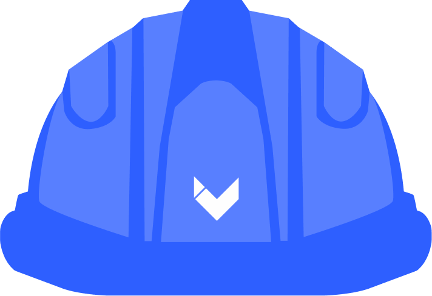

<!-- PROJECT LOGO -->
<br />
<div align="center">
  <a href="https://github.com/TDung939/makerspaces.vinmaker.org">
    
  </a>

  <p align="center">
    A network of connected makerspaces and workshops at VinUniversity.
    <br />
    <a href="https://vinmakersoc.github.io/makerspace-network-docs/"><strong>Explore the docs »</strong></a>
    <br />
    <br />
    <a href="https://makerspaces.vinmaker.org/">View Website</a>
    ·
    <a href="https://github.com/TDung939/makerspaces.vinmaker.org/issues">Report Bug</a>
    ·
    <a href="https://github.com/TDung939/makerspaces.vinmaker.org/issues">Request Feature</a>
  </p>
</div>

<!-- TABLE OF CONTENTS -->
<details>
  <summary>Table of Contents</summary>
  <ol>
    <li>
      <a href="#about-the-project">About The Project</a>
      <ul>
        <li><a href="#built-with">Built With</a></li>
      </ul>
    </li>
    <li>
      <a href="#getting-started">Getting Started</a>
      <ul>
        <li><a href="#prerequisites">Prerequisites</a></li>
        <li><a href="#installation">Installation</a></li>
      </ul>
    </li>
    <li><a href="#usage">Usage</a></li>
    <li><a href="#roadmap">Roadmap</a></li>
    <li><a href="#contributing">Contributing</a></li>
    <li><a href="#license">License</a></li>
    <li><a href="#contact">Contact</a></li>
    <li><a href="#acknowledgments">Acknowledgments</a></li>
  </ol>
</details>

<!-- ABOUT THE PROJECT -->
## About The Project

<!-- [![Product Name Screen Shot][product-screenshot]](https://example.com) -->

VinUniversity Makerspace Network is the network of connected makerspaces and workshops at VinUniversity. A network of genuine collaboration and shared values. These values are centered on the principle of barrier free access to tools and tech for all Students, Staff and External Partners.

The VinUniversity Makerspace Network supports the University’s strategic goal of cross Faculty collaboration, project-based learning, course integration of student led projects, industry engagement and building as an entrepreneurial ecosystem.

<p align="right">(<a href="#top">back to top</a>)</p>

### Built With

* [Next.js](https://nextjs.org/)
* [React.js](https://reactjs.org/)
* [Chakra UI](https://chakra-ui.com/)
* [Strapi](https://strapi.io/)

<p align="right">(<a href="#top">back to top</a>)</p>

<!-- GETTING STARTED -->
## Getting Started
### Prerequisites

First install the following: 
- Git from [here](https://git-scm.com/downloads)
- Node and NPM from [here](https://nodejs.org/en/) (choose the LTS version)

### Installation

1. Clone the repo
   ```sh
   git clone https://github.com/TDung939/makerspaces.vinmaker.org
   ```
2. Create an ```.env.local``` file from ```.env.local.example``` 
3. Install NPM packages
   ```sh
   npm install
   npm run dev
   ```
4. Open [http://localhost:3000](http://localhost:3000) with your browser to see the result.
<p align="right">(<a href="#top">back to top</a>)</p>


<!-- USAGE EXAMPLES -->
<!-- ## Usage (Need Updating)

Feel free to use this project to host your own Hackathon events.

Visit [demo](#)


_Please refer to the [Documentation](#) to customize your event_

<p align="right">(<a href="#top">back to top</a>)</p> -->


<!-- ROADMAP -->
## Roadmap

- [x] Booking Service
- [] Realtime machines status
- [] User Dashboard Improvement
- [] Multi-language Support
  - [] Vietnamese

See the [open issues](https://github.com/TDung939/makerspaces.vinmaker.org/issues) for a full list of proposed features (and known issues).

<p align="right">(<a href="#top">back to top</a>)</p>


<!-- CONTRIBUTING -->
## Contributing

This project is open to contributions. Every contribution, be it a feature request, bug report, or pull request is **greatly appreciated**.

If you have a suggestion that would make this better, please fork the repo and create a pull request. You can also simply open an issue with the tag "enhancement".
Don't forget to give the project a star! Big Thanks!

1. Fork the Project
2. Create your Feature Branch (`git checkout -b feature/AmazingFeature`)
3. Commit your Changes (`git commit -m 'Add some AmazingFeature'`)
4. Push to the Branch (`git push origin feature/AmazingFeature`)
5. Open a Pull Request

<p align="right">(<a href="#top">back to top</a>)</p>


<!-- LICENSE -->
## License

Distributed under the MIT License. See `LICENSE.txt` for more information.

<p align="right">(<a href="#top">back to top</a>)</p>


<!-- CONTACT -->
## Contact

Trung Dung - dungnguyenhoangtrung@gmail.com

Project Link: [https://github.com/TDung939/makerspaces.vinmaker.org](https://github.com/TDung939/makerspaces.vinmaker.org)

<p align="right">(<a href="#top">back to top</a>)</p>


<!-- ACKNOWLEDGMENTS -->
<!-- ## Acknowledgments

List of resources I find helpful and would like to give credit to:


<p align="right">(<a href="#top">back to top</a>)</p> -->

<!-- MARKDOWN LINKS & IMAGES -->
<!-- https://www.markdownguide.org/basic-syntax/#reference-style-links -->
<!-- [contributors-shield]: https://img.shields.io/github/contributors/othneildrew/Best-README-Template.svg?style=for-the-badge
[contributors-url]: https://github.com/othneildrew/Best-README-Template/graphs/contributors -->
<!-- [forks-shield]:https://img.shields.io/github/forks/TDung939/HackaCMS?style=for-the-badge -->
<!-- [forks-url]: https://github.com/TDung939/HackaCMS
[stars-shield]: https://img.shields.io/github/stars/TDung939/HackaCMS?style=for-the-badge
[stars-url]: https://github.com/TDung939/HackaCMS/stargazers
[issues-shield]: https://img.shields.io/github/issues/TDung939/HackaCMS?style=for-the-badge
[issues-url]: https://github.com/TDung939/HackaCMS/issues
[license-shield]: https://img.shields.io/github/license/TDung939/HackaCMS?style=for-the-badge
[license-url]: https://github.com/TDung939/HackaCMS/blob/master/LICENSE.txt
[linkedin-shield]: https://img.shields.io/badge/-LinkedIn-black.svg?style=for-the-badge&logo=linkedin&colorB=555
[linkedin-url]: https://www.linkedin.com/in/dung-nht/ -->